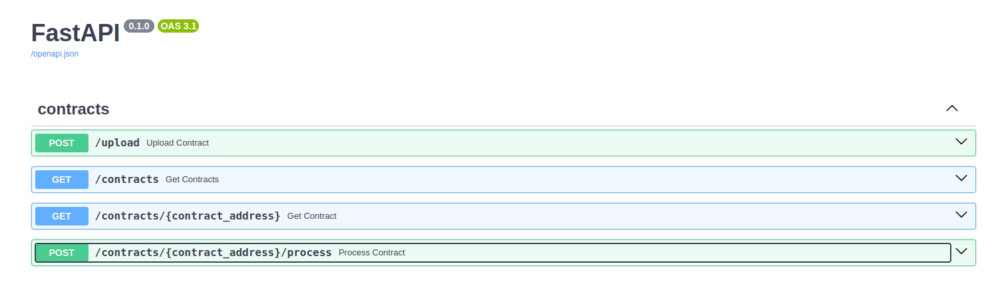

# ERC20 Detector

####  A web application designed to detect the ERC20 standard.
It is coded following the principles of Clena Architecture and SOLID.



## Endpoints

#### POST /upload/
###### Uploads the source code of the contract with the *contract_address* address to the database

```bash
curl -X "POST" \
  "http://127.0.0.1:8000/upload/" \
  -d '{
      "contract_address": "0xf8C3527CC04340b208C854E985240c02F7B7793f"
  }'
```
```json
{
  "id": {
    "value": "3fa85f64-5717-4562-b3fc-2c963f66afa6"
  },
  "contract_address": "0xf8C3527CC04340b208C854E985240c02F7B7793f",
  "source_code": "/**\nFrontier Contracts\n*/\n\npragma solidity 0.6.2;\n\n\n// SPDX-Lice...",
  "is_erc20": null,
  "erc20_version": null,
  "status": "Waits processing"
}
```

#### GET /contracts/<contract_address>
```bash
curl -X "GET" "http://localhost:8000/contract/0xf8C3527CC04340b208C854E985240c02F7B7793f"
```
```json
{
  "id": {
    "value": "3fa85f64-5717-4562-b3fc-2c963f66afa6"
  },
  "contract_address": "0xf8C3527CC04340b208C854E985240c02F7B7793f",
  "source_code": "/**\nFrontier Contracts\n*/\n\npragma solidity 0.6.2;\n\n\n// SPDX-Lice...",
  "is_erc20": null,
  "erc20_version": null,
  "status": "Waits processing"
}
```

#### GET /contracts/<contract_address>
```bash
curl -X "GET" "http://localhost:8000/contracts?status=Waits%20processing&limit=20&offset=0"
```
```json
{
  "total": 1,
  "contracts": [
    {
      "id": {
        "value": "3fa85f64-5717-4562-b3fc-2c963f66afa6"
      },
      "contract_address": "0xf8C3527CC04340b208C854E985240c02F7B7793f",
      "source_code": "/**\nFrontier Contracts\n*/\n\npragma solidity 0.6.2;\n\n\n// SPDX-Lice...",
      "is_erc20": null,
      "erc20_version": null,
      "status": "Waits processing"
    }
  ]
}
```

#### POST /contracts/<contract_address>/process
###### Processes the source code of the contract and detects the standard/ To detect the er20 standard, I use the solidity compiler. The application installs all possible versions of it and uses the one that requires a specific source code for detection.

```bash
curl -X "POST" "http://127.0.0.1:8000/contracts/0xf8C3527CC04340b208C854E985240c02F7B7793f/process"
```

```json
{
  "contract_address": "0xf8C3527CC04340b208C854E985240c02F7B7793f",
  "is_erc20": true,
  "erc20_version": null
}
```

## ERC 20 Version.
I spent a lot of time searching for information about this, but I still didn't understand what was required of me, so I left **null**. 
But it won't be difficult to fix, since the code is built in such a way that making changes and adjustments there is easy, fast, convenient and does not cause unpredictable errors.

## The ability to detect other standards
As I said above, the code is built in such a way that it will be easy and convenient to add any changes. Let's take an example of adding a detector of another standard. All that is required is to identify new adapters for the following ports: ContractDetector and SourceCodeCompiler, and inejct them when building the ioc container. These ports define the following interfaces:

```python
class ContractDetector(Protocol):
    @abstractmethod
    async def is_contract_detected(self, data: list[ContractSignature]) -> bool:
        raise NotImplementedError
```

```python
class SourceCodeCompiler(Protocol):
    @abstractmethod
    async def get_source_code_signatures(
        self, source_code: str, contract_name: str
    ) -> list[ContractSignature]:
        raise NotImplementedError

```
In other words, this means that we do not change the business logic of the application in any way.

## Horizontal scaling
For horizontal scaling, you can use kubernetes, which is independently engaged in scaling, I have provided yaml files for deployments and docker services.

## Running code
1. Install docker and docker compose
2. Provide env variables
* `ETHERSCAN_API_KEY` - your etherscan api key
* `POSTGRES_HOST` - host of your postgres database
* `POSTGRES_DB` - db name of your postgres database
* `POSTGRES_USER` - user name of your postgres database
* `POSTGRES_PASSWORD` - password of your postgres database
* `DB_PORT` - port of your postgres database
3. Run app
```sh
docker compose up --build
```

## Examples of contract addresses from https://etherscan.io/tokens
1. 0xf8C3527CC04340b208C854E985240c02F7B7793f
2. 0xbb0e17ef65f82ab018d8edd776e8dd940327b28b
3. 0xb62132e35a6c13ee1ee0f84dc5d40bad8d815206